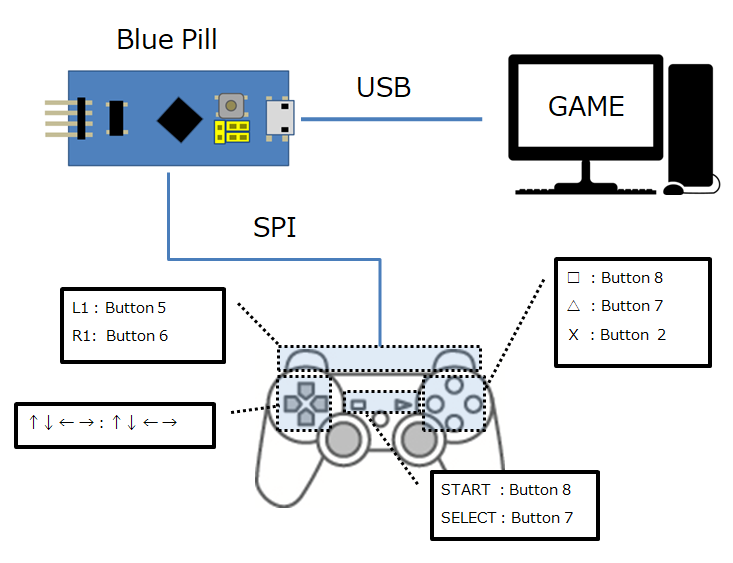

# mbedos2-bluepill-ps2controller-host
Bluepill host application for PS2 controller
   
 

## Requirement

- [STM32F103C8T6 minimum Development Board(BluePill)](https://www.aitendo.com/product/13348)
- [ST Link V2 Programmer For STM8 STM32](https://www.aitendo.com/product/16082)
- Windows 10 Pro
- Mbed CLE(mbed os 2)


##  Pin connections
|BluePill  |USB Serial Board  |
|---|---|
|GND  |GND  |
|A2  |RX  |

|BluePill  |PC |
|---|---|
|USB Micro-B  |USB-A |

|Controller  |BluePill  |Note  |
|---|---|---|
|Data(miso) | PA_6 |insert 1k pull-up to 5V|
|CMD(mosi)  | PA_7 ||
|GND  | GND ||
|3V3  | 3V3 ||
|SEL  | PB_6 |insert 1k pull-up to 5V|
|CLK  | PA_5 ||

### Programmer
  


## Quick start

1. Installation
* clone this repository
    * In Source Tree, need to get submodule recursively.
* install [STM32 ST-LINK Utility](https://www.st.com/content/st_com/ja/products/development-tools/software-development-tools/stm32-software-development-tools/stm32-programmers/stsw-link004.html?dl=Esr3641WBLOeWDySnK7N%2FA%3D%3D%2Ct2UU9IOHq6oAQxLOeevmNznGb5UNia9EEIGo7rnBkXvgp2qXK%2FEhonXMx8Lv1ONG%2BBGz6oLVvvRLC0fX4sqXLqxqRc%2FaGWkkp%2BzgVl3V8VaVax5Ek3%2B%2FnKEA2DoYmEBgGjVibstcCnqSQu3K%2FdrpwoyD%2Fjq5kyQo9fUPLD0r%2BkkH0XRI92wrVFJ9dHYPwGB7u6pTDyvFHgJWkSrDEPGqkkzKByl9zUs%2FO6htinjzwmSaoxvVa4ApHl6LOu%2BqjipivC6FasmqiGbXpOdj6xW6U7O5Jh8AJotVeWWvtEaXTJh%2FrOTkMRvp8yAwSk9P2ub0t%2Fju7tadlwUCLflzrdsBLw%3D%3D&uid=BcpcApvrxWmbd6DozNPYo6GSOuPdfRWxFiMMWdA72HaQtyscK/gjzQ==)(including usb device driver)
* update ST-Link V2 firmware with ST-LINK Utility
    * ST-LINK -> Firmware update -> Device Connect

* install [mbed-cli-windows-installer](https://github.com/ARMmbed/mbed-cli-windows-installer/releases)

* install python modules
```txt
C:\WorkSpace\mbedos2-bluepill-ps2controller-host> pip install -r .\tools\requirements.txt
C:\WorkSpace\mbedos2-bluepill-ps2controller-host> pip install mbed-cli==1.10.1 pyelftools jsonschema
```
2. Change Vender ID & Product ID(USBJoystick.h)
```txt
     USBJoystick(uint16_t vendor_id = 0x????, uint16_t product_id = 0x????, uint16_t product_release = 0x0001, int waitForConnect = true):    // Buffalo USB JoyStick
```

3. Build & upload project
```txt
C:\WorkSpace\mbedos2-bluepill-ps2controller-host> mbed config root .
C:\WorkSpace\mbedos2-bluepill-ps2controller-host> mbed deploy
C:\WorkSpace\mbedos2-bluepill-ps2controller-host> mbed compile -m BLUEPILL_F103C8 -t GCC_ARM
C:\WorkSpace\mbedos2-bluepill-ps2controller-host> ST-LINK_CLI.exe -c SWD -P .\BUILD\BLUEPILL_F103C8\GCC_ARM\mbedos2-bluepill-ps2controller-host.bin 0x8000000 -Rst -Run -NoPrompt 
```
* if clean building, `mbed compile -c -m BLUEPILL_F103C8 -t GCC_ARM`
* `mbed deploy` for extract library files
* I use mbed-dev submodule (need to get recursively or update in Source Tree)  
  
settings: get recursively  

  
　  
  
menu: update submodule  

  

## Other Info
* see [wiki](https://github.com/bigw00d/software-development-tips/tree/master/02_stm32)

## Related Links
* [USBDevice_STM32F103](https://os.mbed.com/users/hudakz/code/USBDevice_STM32F103/)
* [PS_PAD](https://os.mbed.com/users/okini3939/code/PS_PAD/)
* [BluePillのmbed VSCode開発環境を構築してみた](https://qiita.com/kohei0302/items/6aa927907fe868ef0b50)
    * windows is not good for it(for vscode settings ex. make command)
* [Mbed OS 2のサポートがいつ終わっても良いようにローカル環境を構築する方法【改訂版】](https://qiita.com/toyowata/items/86a312158187cafe3f7d)
