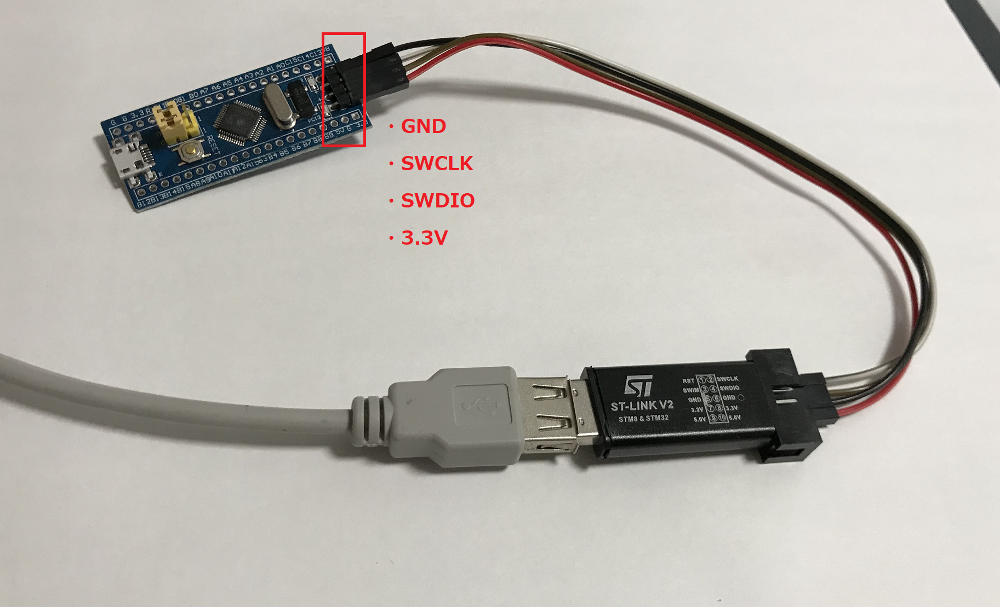
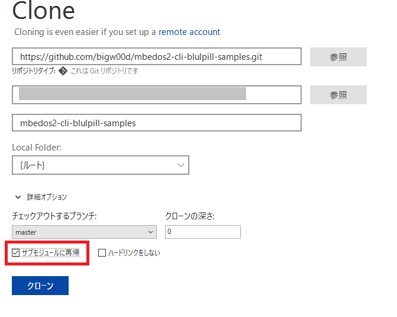
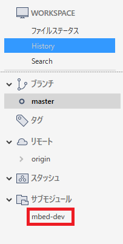

# mbedos2-cli-blulpill-samples

  

## Quick start with BluePill

1. set up
* install [STM32 ST-LINK Utility(including usb device driver)](https://www.st.com/content/st_com/ja/products/development-tools/software-development-tools/stm32-software-development-tools/stm32-programmers/stsw-link004.html?dl=Esr3641WBLOeWDySnK7N%2FA%3D%3D%2Ct2UU9IOHq6oAQxLOeevmNznGb5UNia9EEIGo7rnBkXvgp2qXK%2FEhonXMx8Lv1ONG%2BBGz6oLVvvRLC0fX4sqXLqxqRc%2FaGWkkp%2BzgVl3V8VaVax5Ek3%2B%2FnKEA2DoYmEBgGjVibstcCnqSQu3K%2FdrpwoyD%2Fjq5kyQo9fUPLD0r%2BkkH0XRI92wrVFJ9dHYPwGB7u6pTDyvFHgJWkSrDEPGqkkzKByl9zUs%2FO6htinjzwmSaoxvVa4ApHl6LOu%2BqjipivC6FasmqiGbXpOdj6xW6U7O5Jh8AJotVeWWvtEaXTJh%2FrOTkMRvp8yAwSk9P2ub0t%2Fju7tadlwUCLflzrdsBLw%3D%3D&uid=BcpcApvrxWmbd6DozNPYo6GSOuPdfRWxFiMMWdA72HaQtyscK/gjzQ==)
* update ST-Link V2 firmware with ST-LINK Utility
    * ST-LINK -> Firmware update -> Device Connect

* install [mbed-cli-windows-installer](https://github.com/ARMmbed/mbed-cli-windows-installer/releases)

1. build & upload project
```txt
C:\WorkSpace\mbedos2-cli-blulpill-samples> mbed config root .
C:\WorkSpace\mbedos2-cli-blulpill-samples> mbed deploy
C:\WorkSpace\mbedos2-cli-blulpill-samples> mbed compile -m BLUEPILL_F103C8 -t GCC_ARM
C:\WorkSpace\mbedos2-cli-blulpill-samples> ST-LINK_CLI.exe -c SWD -P .\BUILD\BLUEPILL_F103C8\GCC_ARM\mbedos2-cli-blulpill-samples.bin 0x8000000 -Rst -Run -NoPrompt 
```
* if clean building, `mbed compile -c -m BLUEPILL_F103C8 -t GCC_ARM`
* `mbed deploy` for extract library
* I use mbed-dev submodule (need to get recursively or update in Source Tree)
  
　
  


## Use Arduino IDE

* install [Arduino STM32 device](https://github.com/rogerclarkmelbourne/Arduino_STM32/wiki)
or
* board manager (I use this)
    * tool > board > board manager > Arduino SAM Boards (32-bits ARM Cortex-M3)
    * board setting
        * Board: Generic STM32F103C series
        * Optimize: Smallest
        * Variant: STM32F103C8 (20k RAM, 64k Flash) or STM32F103CB (20k RAM, 128k Flash)
        * CPU Speed(MHz): 72MHz (Normal)
        * Upload method: STLink
        * Serial port: (non selection)
        * Programmer: USBasp

## Other Info
* see [wiki](https://github.com/bigw00d/software-development-tips/tree/master/02_stm32)

## Related Links
* [USBDevice_STM32F103](https://os.mbed.com/users/hudakz/code/USBDevice_STM32F103/)
* [USBComposite_stm32f1(for Arduino)](https://github.com/arpruss/USBComposite_stm32f1)
* [BluePillのmbed VSCode開発環境を構築してみた](https://qiita.com/kohei0302/items/6aa927907fe868ef0b50)
    * windows is not good for it(ex. make command)
* [Install OpenOCD](https://os.mbed.com/teams/Renesas/wiki/Exporting-to-e2studio-with-CMSIS_DAP-DBG#install-openocd)
* [Blue Pill + mbed](https://qiita.com/nanbuwks/items/26241a90004665570fe6)
* [STM32F103C8T6 でLチカ](https://qiita.com/sugasaki/items/98bbff89bbd7f235525f)
