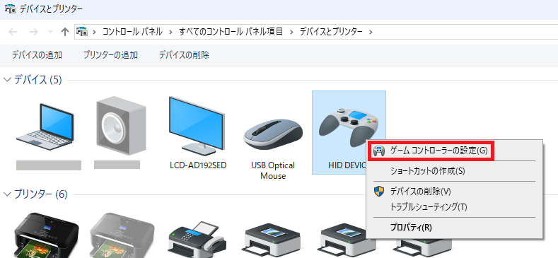
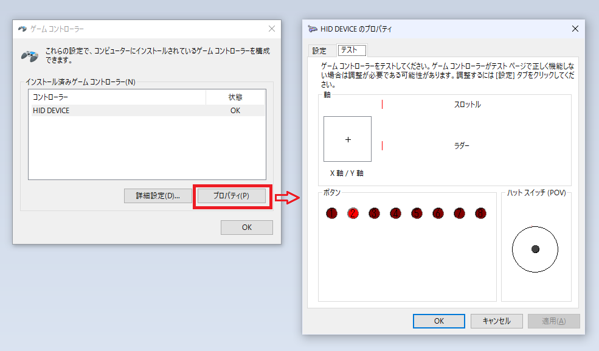

## Overview
USB Joystick sample code

##  Connections
|BluePill  |PC |
|---|---|
|USB Micro-B  |USB-A |

## Code
```main.c
#include "stm32f103c8t6.h"
#include "mbed.h"
#include "USBJoystick.h"

USBJoystick joystick;

int16_t moveTable[9][2] = {
    {0         , JY_MIN_ABS  },	//	UP         
    {JX_MAX_ABS, JY_MIN_ABS  },	//	UPRIGHT   
    {JX_MAX_ABS, 0           },	//	RIGHT      
    {JX_MAX_ABS, JY_MAX_ABS  },	//	RIGHTDOWN 
    {0         , JY_MAX_ABS  },	//	DOWN       
    {JX_MIN_ABS, JY_MAX_ABS  },	//	DOWNLEFT  
    {JX_MIN_ABS, 0           },	//	LEFT       
    {JX_MIN_ABS, JY_MIN_ABS  },	//	LEFTUP    
    {0         , 0           }	//	NEUTRAL    
};

int main() {
    int16_t x = 0;
    int16_t y = 0;
    uint32_t buttons = 0;    
    uint8_t state = 0;

    confSysClock();         //Configure system clock (72MHz HSE clock, 48MHz USB clock)
    
    while (1) {
        switch (state) {
            case 0: //case 0 .. 8: joystick move(UP, UPRIGHT, .. , NEUTRAL)
            case 1:
            case 2:
            case 3:
            case 4:
            case 5:
            case 6:
            case 7:
            case 8:
                x = moveTable[state][0];  // value -127 .. 128
                y = moveTable[state][1];  // value -127 .. 128
                joystick.move(x, y);
                break;
            case 9:  //case 9 .. 16: joystick button(button1, button2, .. , button8)
            case 10:
            case 11:
            case 12:
            case 13:
            case 14:
            case 15:
            case 16:
                buttons = (0x01 << (state-9)) & 0xFF;   // value    0 .. 7, one bit per button     
                joystick.buttons(buttons);
                break;
            default:
                ;
                break;
        }
        state = (state + 1) % 17;
        joystick.update();
        wait(1);
    }
}

```

## Usage 

1. Connect PC to Bluepill with USB cable

1. Check Joystick property  

  

## Related Links
* [USBJoystick(mbed library)](https://os.mbed.com/users/wim/code/USBJoystick/)
